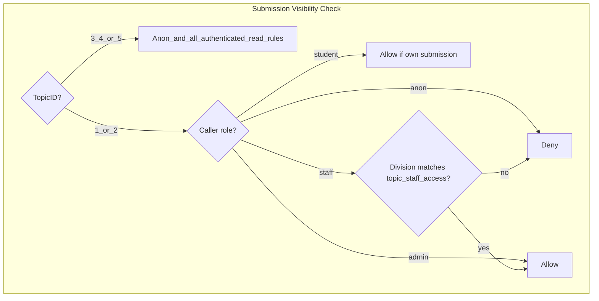
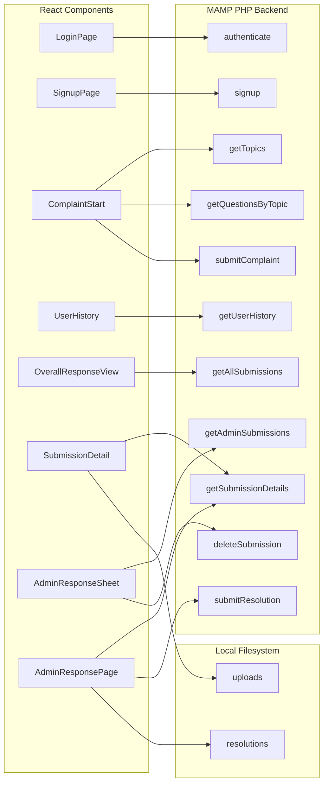
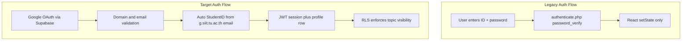
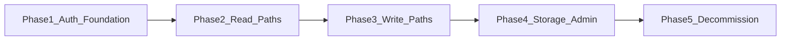

# SIIT Complaint System: Legacy-to-Supabase Migration Roadmap

## Stack Parameters Acknowledged

Per [cursor.md](cursor.md) (project rules; no `.cursorrules` file exists in this repo):

| Parameter | Target Standard |
|-----------|-----------------|
| Frontend | React 18, Tailwind CSS, React Router |
| Deployment | Vercel (SPA rewrites already in [frontend/vercel.json](frontend/vercel.json)) |
| Database & Auth | Supabase PostgreSQL + Supabase Auth |
| Data access | `@supabase/supabase-js` from the browser; env via `REACT_APP_SUPABASE_URL` / `REACT_APP_SUPABASE_ANON_KEY` |
| Serverless | Node handlers in `/api` only when client SDK + RLS are insufficient |
| Legacy | Do not extend PHP/MySQL; retire [backend/](backend/) after migration |
| Schema | Users linked to `auth.users` via `UUID`; RLS on all public tables; anonymous read for public submissions/resolutions |

**Current reality:** The React UI is partially modernized (Tailwind, routing, context) but **100% of data and auth still flows through hardcoded MAMP PHP endpoints**. Supabase is scaffolded ([supabase/config.toml](supabase/config.toml), root [schema.sql](schema.sql)) but not wired into the frontend.

---

## Locked Business Rules (Confirmed)

These decisions are fixed for implementation:

### Auth & Identity

| Rule | Implementation |
|------|----------------|
| **Allowed email domains** | Only `@siit.tu.ac.th` (staff) and `@g.siit.tu.ac.th` (students). Reject all other Google accounts at sign-in. |
| **Student ID source** | Do **not** ask students to enter StudentID. Parse from Google email local-part: `6xxxxxxxxx@g.siit.tu.ac.th` → `StudentID = '6xxxxxxxxx'` (10-digit ID starting with 6). |
| **Student auto-provision** | On first Google login with a valid student email, upsert a `student` row: `StudentID` from email, `Email` from auth, `UUID = auth.uid()`. [SignupPage.js](frontend/src/components/SignupPage.js) becomes **Year + Department completion only** (no password, no StudentID field). |
| **Staff/Admin provisioning** | Pre-seed `staff`/`admin` rows with `@siit.tu.ac.th` emails. On first login, link `UUID = auth.uid()` by email match. No public staff signup. |

**Domain enforcement (defense in depth):**

1. **Supabase Auth Hook** (`auth.hook.custom_access_token` or `before-user-created`): reject emails not matching `@siit.tu.ac.th` or `@g.siit.tu.ac.th`.
2. **Client-side guard** in `AuthProvider`: after OAuth, validate email domain; call `signOut()` + show error if invalid.
3. **Student email regex:** `^(\d{10})@g\.siit\.tu\.ac\.th$` where captured group is the StudentID.

### Sensitive Topic Visibility (Topics 1 & 2)

Topics 1 (*Academics*) and 2 (*Physical or Mental Abusements*) require stricter access than the legacy PHP app (which only hid them from the public list).

| Viewer | Topics 3–5 | Topic 1 (Academics) | Topic 2 (Abuse) |
|--------|------------|---------------------|-----------------|
| **Anonymous** | Read submissions/resolutions | **Hidden** | **Hidden** |
| **Student** | Read public list + own submissions | Submit + read **own only** | Submit + read **own only** |
| **Staff (matched Division)** | Full admin read/write | Read/write if `staff.Division = 'Academic Affairs'` | Read/write if `staff.Division = 'Student Affairs'` |
| **Staff (other Division)** | Full admin read/write | **Hidden** | **Hidden** |
| **Admin (`admin` table)** | Full access | Full access | Full access |

**Topic → staff Division mapping (locked):**

| TopicID | Topic Name | Required `staff.Division` |
|---------|------------|---------------------------|
| 1 | Academics | `Academic Affairs` |
| 2 | Physical or Mental Abusements | `Student Affairs` |

Implement via a seed table `topic_staff_access ("TopicID", "Division")` plus a SQL helper `can_access_submission(submission_id)` used in RLS policies. Legacy seed data uses divisions like `Building`, `SA`, `Finance` — staff roster must be updated to include `Academic Affairs` and `Student Affairs` rows (or migrate `SA` → `Student Affairs` as appropriate).



---

## 1. Architectural Assessment

### Current React Structure

```
frontend/src/
├── App.js              # Routes + in-memory auth state (no persistence)
├── contexts.js         # AuthContext, NavigationContext (minimal)
├── index.js / index.css
└── components/         # 15 flat page components (no lib/, hooks/, or services/)
    ├── Public flows: MenuAnonymous, OverallResponseView, SubmissionDetail, PublicHeader
    ├── Auth flows:    LoginPage, SignupPage
    ├── Student flows: UserMenu, UserHistory, ComplaintStart, ThankYouPage, AuthHeader
    └── Admin flows:   AdminMenu, AdminResponseSheet, AdminResponsePage
```

**Strengths:** Clear route guards in [App.js](frontend/src/App.js), reusable headers (`PublicHeader`, `AuthHeader`), consistent Tailwind theming (`siit-purple`, `siit-light`).

**Gaps:** No data layer abstraction; each component calls `fetch()` directly. No Supabase SDK. No session persistence (refresh loses auth). [TopicSelection.js](frontend/src/components/TopicSelection.js) is **dead code** (never imported). [frontend/package.json](frontend/package.json) lacks `@supabase/supabase-js`.

### Legacy API Call Map

Every network call targets `http://localhost/siit-complaint-system/backend/*.php`:



| Legacy PHP Endpoint | Consumer(s) | Supabase Replacement (later phases) |
|---------------------|-------------|-------------------------------------|
| `authenticate.php` | LoginPage | `supabase.auth.signInWithOAuth({ provider: 'google' })` + profile lookup |
| `signup.php` | SignupPage | Auto-provision `student` from Google email; SignupPage collects Year + Department only |
| `getTopics.php` | ComplaintStart, TopicSelection | `supabase.from('topic').select()` — all topics available for submission UI |
| `getQuestionsByTopic.php` | ComplaintStart | `supabase.from('question').select().eq('TopicID', id)` |
| `submitComplaint.php` | ComplaintStart | Insert `submission` + `user_answer`; Storage for files |
| `getUserHistory.php` | UserHistory | Query `submission` filtered by authenticated student's `StudentID` (includes own Topics 1–2) |
| `getAllSubmissions.php` | OverallResponseView | RLS: anon + students see Topics 3–5 only; staff see Topics 1–2 per Division |
| `getSubmissionDetails.php` | SubmissionDetail, AdminResponsePage | Join query on submission/answers/resolution |
| `getAdminSubmissions.php` | AdminResponseSheet | Staff/admin RLS policy |
| `submitResolution.php` | AdminResponsePage | Insert `resolution` + update `submission.Status` |
| `deleteSubmission.php` | AdminResponseSheet | Admin-only delete (currently **no auth check** in PHP) |

### Auth Architecture Today vs Target



Legacy auth in [backend/authenticate.php](backend/authenticate.php) checks `admin` → `staff` → `student` tables with `password_verify()` on locally stored bcrypt hashes. React stores `userId` as **legacy string IDs** (`6622781027`, `1003`), not Supabase UUIDs.

### Schema: Legacy MySQL vs Target Supabase

Key deltas between [projectsiit_archived.sql](projectsiit_archived.sql) and [schema.sql](schema.sql):

| Area | Legacy MySQL | Target Supabase |
|------|--------------|-----------------|
| Primary keys (users) | `AdminID` / `StaffID` / `StudentID` (int/text) | `UUID` FK → `auth.users.id` |
| Passwords | `Password` column on admin/staff/student | Removed — Supabase Auth only |
| Submission date | `Date` (date) | `CreatedAt` (timestamptz) |
| Answers table | `useranswer` | `user_answer` (+ `AnsURL` for Storage URLs) |
| Resolution author | `AdminID` | `StaffID` |
| Resolution attachments | `AttachmentPath` (local path) | `ResURL` (Storage URL) |
| Resolution timestamp | `ResDate` (date) | `ResAt` (timestamptz) |
| Email | Not on student/staff | `Email` columns added |

**Critical gap:** [schema.sql](schema.sql) enables RLS on all tables but defines **zero `CREATE POLICY` statements**. With RLS enabled and no policies, Postgres denies all access for `anon`/`authenticated` roles. Policies must be added before any client SDK calls will succeed.

**Supabase project maturity:** Only [supabase/config.toml](supabase/config.toml) and `.gitignore` exist — no `supabase/migrations/`, no `seed.sql`, no linked remote project artifacts in repo.

---

## 2. Technical Debt Checklist

### Remove (post-migration)

- Entire [backend/](backend/) directory (13 PHP scripts + MAMP config)
- [backend/hash_password.php](backend/hash_password.php) — manual bcrypt tooling
- [projectsiit_archived.sql](projectsiit_archived.sql) — reference only; keep until data migration complete
- Outdated [README.md](README.md) MAMP/XAMPP setup instructions
- Dead component [frontend/src/components/TopicSelection.js](frontend/src/components/TopicSelection.js)
- Hardcoded `http://localhost/siit-complaint-system/backend/` URLs in 9 components
- Local file path references in [SubmissionDetail.js](frontend/src/components/SubmissionDetail.js) (`backend/uploads/`, `backend/resolutions/`)

### Refactor

- **[App.js](frontend/src/App.js):** Replace `useState` auth with Supabase session listener; derive `userRole` from `student`/`staff`/`admin` tables keyed by `auth.user.id`
- **[contexts.js](frontend/src/contexts.js):** Expand to expose `supabase`, `session`, `profile`, and async `signInWithGoogle` / `signOut`
- **[LoginPage.js](frontend/src/components/LoginPage.js):** Replace ID/password form with Google OAuth button; remove props drilling (`setIsAuthenticated`, etc.)
- **[SignupPage.js](frontend/src/components/SignupPage.js):** Remove password + StudentID fields; post-OAuth form collects **Year + Department only**; `StudentID` and `Email` derived from Google account
- **Route guards:** Gate on `session` + resolved role, not ephemeral React state
- **All data components:** Extract Supabase queries into `frontend/src/lib/` or `frontend/src/services/` modules (one module per domain: auth, submissions, topics, admin)
- **File uploads:** Move from PHP `move_uploaded_file` to Supabase Storage buckets (`complaint-evidence`, `resolution-attachments`) with RLS-aligned bucket policies
- **Column naming:** Frontend currently expects PascalCase API fields (`SubmissionID`, `QText`); decide whether to keep DB PascalCase (current schema) or add a view layer — consistency matters for query ergonomics

### Add (missing infrastructure)

- `@supabase/supabase-js` in [frontend/package.json](frontend/package.json)
- `frontend/.env.example` with `REACT_APP_SUPABASE_URL`, `REACT_APP_SUPABASE_ANON_KEY`
- `frontend/src/lib/supabaseClient.js` — singleton client
- `supabase/migrations/` — versioned schema + RLS policies + `topic_staff_access` table (promote root [schema.sql](schema.sql))
- RLS policies enforcing: domain-valid users; anon public read for Topics 3–5 only; student own-data + own sensitive submissions; staff Division-scoped access to Topics 1–2; admin full access
- Supabase Auth Hook (Edge Function) rejecting non-`@siit.tu.ac.th` / non-`@g.siit.tu.ac.th` emails
- `frontend/src/lib/parseStudentEmail.js` — regex helper for StudentID extraction
- Supabase Storage buckets + policies
- Optional `/api` Vercel functions for operations that must not run client-side (bulk delete, service-role provisioning)
- Database trigger or Edge Function to auto-link Google email domain to pre-seeded `staff`/`admin` rows

### Security Debt (fix during migration)

- PHP endpoints have **no authentication** — anyone can call `deleteSubmission.php`, `getAdminSubmissions.php`, `submitResolution.php`
- CORS `Access-Control-Allow-Origin: *` on all PHP scripts
- DB credentials hardcoded in [backend/config.php](backend/config.php) (`root`/`root`)
- Client-side role checks only — no server enforcement until RLS is live
- `admin.Role` default in [schema.sql](schema.sql) is `'Student'` — likely incorrect; should default to `'Admin'` or require explicit role on insert

---

## 3. Multi-Phase Migration Roadmap



| Phase | Scope | Exit Criteria |
|-------|-------|---------------|
| **1** | Supabase project, schema, RLS baseline, client SDK, Google OAuth + domain gate | Valid `@g.siit.tu.ac.th` / `@siit.tu.ac.th` user signs in; student auto-provisioned; role resolved |
| **2** | Read-only public + authenticated views | Overall view respects topic visibility; submission detail blocked for unauthorized sensitive topics |
| **3** | Student write paths | Complaint submission (all topics), user history, Year/Department profile completion |
| **4** | Admin/staff + Storage | Admin dashboard, resolutions, file uploads, delete |
| **5** | Decommission legacy | Remove PHP backend, update README, Vercel env vars, data migration script run |

---

## 4. Phase 1 Action Plan — Supabase Client + Google OAuth

Sequential blueprint (do not skip ordering — RLS policies must exist before client testing):

### Step 1: Supabase Project & Local CLI Alignment

1. Create or link a Supabase cloud project (SIIT org).
2. From repo root (CLI already in root [package.json](package.json)): `supabase link --project-ref <ref>`.
3. Copy cloud URL and anon key for frontend env vars.
4. Add `frontend/.env.local` (gitignored) and `frontend/.env.example` (committed, no secrets).

### Step 2: Database Schema, Topic Access Table & RLS Policies

1. Create initial migration: `supabase migration new initial_schema`.
2. Port [schema.sql](schema.sql) into the migration; fix `admin.Role` default to `'Admin'`.
3. Add migration `topic_staff_access`:

```sql
CREATE TABLE public.topic_staff_access (
  "TopicID" bigint NOT NULL REFERENCES public.topic("TopicID"),
  "Division" text NOT NULL,
  PRIMARY KEY ("TopicID", "Division")
);
INSERT INTO public.topic_staff_access VALUES
  (1, 'Academic Affairs'),
  (2, 'Student Affairs');
```

4. Add migration `rls_policies` with a `SECURITY DEFINER` helper `can_access_submission(submission_id bigint)` that evaluates:
   - Topic 3–5: allow anon read (submissions/resolutions), authenticated read per role
   - Topic 1–2 + anon: deny
   - Topic 1–2 + student: allow only if `submission."StudentID"` matches caller's student row
   - Topic 1–2 + staff: allow if `staff."Division"` matches `topic_staff_access` for that TopicID
   - Topic 1–2 + admin row exists for `auth.uid()`: allow
5. Apply policies on `submission`, `resolution`, `user_answer`, `question` (questions for Topics 1–2 readable only when user can access that topic).
6. Apply: `supabase db push` (remote) or `supabase start` + `supabase db reset` (local dev).
7. Seed reference data (`topic`, `question`, `topic_staff_access`) from [projectsiit_archived.sql](projectsiit_archived.sql); update staff seed rows to use `Academic Affairs` / `Student Affairs` divisions where appropriate.

### Step 3: Google OAuth + Domain Restriction

1. In Google Cloud Console: create OAuth 2.0 Web client scoped to SIIT Workspace; authorized redirect URI = `https://<project-ref>.supabase.co/auth/v1/callback`.
2. In Supabase Dashboard → Authentication → Providers → Google: enable and paste Client ID/Secret.
3. Set Site URL to `http://localhost:3000` (dev) and production Vercel URL.
4. Add redirect URLs: `http://localhost:3000/**` and `https://<vercel-domain>/**`.
5. Deploy Supabase Edge Function `auth-domain-gate` hooked to `before-user-created` (or validate in `AuthProvider` on first session):
   - Allow if email ends with `@siit.tu.ac.th` OR matches `^\d{10}@g\.siit\.tu\.ac\.th$`
   - Reject otherwise with a clear error message

### Step 4: Install SDK & Create Client Singleton

1. In `frontend/`: `npm install @supabase/supabase-js`.
2. Create [frontend/src/lib/supabaseClient.js](frontend/src/lib/supabaseClient.js):

```javascript
import { createClient } from '@supabase/supabase-js';

const supabaseUrl = process.env.REACT_APP_SUPABASE_URL;
const supabaseAnonKey = process.env.REACT_APP_SUPABASE_ANON_KEY;

if (!supabaseUrl || !supabaseAnonKey) {
  throw new Error('Missing Supabase environment variables');
}

export const supabase = createClient(supabaseUrl, supabaseAnonKey);
```

### Step 5: Auth Provider & Session Lifecycle

1. Create [frontend/src/contexts/AuthProvider.js](frontend/src/contexts/AuthProvider.js) (or extend [contexts.js](frontend/src/contexts.js)):
   - On mount: `supabase.auth.getSession()` + `onAuthStateChange` subscription
   - Validate email domain on every session; sign out if invalid
   - **Student path:** parse StudentID from `@g.siit.tu.ac.th` email; upsert `student` row with `StudentID`, `Email`, `UUID`; if `Year`/`Department` missing → redirect to `/signup`
   - **Staff path:** match pre-seeded `staff.Email`; set `UUID = auth.uid()` on first login
   - **Admin path:** resolve via `admin` table linked to staff/student UUID
   - Expose: `session`, `user`, `profile`, `studentId`, `userRole`, `isAdmin`, `isStudent`, `staffDivision`, `signInWithGoogle()`, `signOut()`
2. Wrap [App.js](frontend/src/App.js) with `AuthProvider` inside `Router`.
3. Replace `handleLogout` with `await supabase.auth.signOut()`.

### Step 6: Google Sign-In UI

1. Refactor [LoginPage.js](frontend/src/components/LoginPage.js):
   - Remove ID/password fields and `fetch(authenticate.php)`
   - Add "Continue with Google" calling:

```javascript
await supabase.auth.signInWithOAuth({
  provider: 'google',
  options: { redirectTo: `${window.location.origin}/portal` },
});
```

2. Handle OAuth return: Supabase JS auto-parses hash/query on load via `getSession()`.
3. Redirect logic: Admin/Staff → `/admin`; Student with complete profile → `/portal`; Student missing Year/Department → `/signup` (profile completion only).

### Step 7: Profile Resolution (No Manual StudentID)

**Students (`@g.siit.tu.ac.th`):**

- Extract `StudentID` from email local-part via [frontend/src/lib/parseStudentEmail.js](frontend/src/lib/parseStudentEmail.js)
- Upsert `student` row on login; never display or accept a StudentID input field
- [SignupPage.js](frontend/src/components/SignupPage.js): collect **Year + Department** only, then `UPDATE student SET Year, Department WHERE UUID = auth.uid()`

**Staff/Admin (`@siit.tu.ac.th`):**

- Pre-seed `staff` rows with institutional emails and correct `Division` values (`Academic Affairs`, `Student Affairs`, etc.)
- On first login, `UPDATE staff SET UUID = auth.uid() WHERE Email = session.user.email`
- Admin users resolved from `admin` table; admins bypass Topic 1/2 Division restrictions

Implement helper [frontend/src/lib/resolveUserProfile.js](frontend/src/lib/resolveUserProfile.js) called after session established.

### Step 8: Route Guard Updates

1. Update [App.js](frontend/src/App.js) protected routes to use `session` from context instead of `isAuthenticated` state.
2. Add loading gate while `getSession()` resolves (prevent flash redirect to `/login`).
3. Keep `/overall-view` and `/view-detail/:id` public routes, but RLS returns 403/empty for Topics 1–2 unless caller is authorized staff/admin or the owning student.

### Step 9: Vercel Environment & Verification Checklist

1. Add env vars in Vercel project settings for production/preview.
2. Verify locally:
   - `@g.siit.tu.ac.th` student signs in; StudentID auto-populated; invalid domain rejected
   - `@siit.tu.ac.th` staff signs in and links to pre-seeded row
   - Session survives page refresh
   - Anon `/overall-view` shows Topics 3–5 only
   - Student cannot open another user's Topic 1/2 submission detail
   - Staff with `Division = 'Academic Affairs'` sees Topic 1 admin queue; `Student Affairs` sees Topic 2
3. Run Supabase security advisors after RLS migration.

### Phase 1 Files Touched (expected)

| Action | Path |
|--------|------|
| Create | `frontend/src/lib/supabaseClient.js`, `frontend/src/lib/parseStudentEmail.js`, `frontend/src/contexts/AuthProvider.js`, `frontend/src/lib/resolveUserProfile.js` |
| Create | `supabase/migrations/*`, `supabase/seed.sql`, `supabase/functions/auth-domain-gate/`, `frontend/.env.example` |
| Modify | `frontend/package.json`, `frontend/src/App.js`, `frontend/src/contexts.js`, `frontend/src/components/LoginPage.js`, `frontend/src/components/SignupPage.js` |
| Defer to Phase 2+ | ComplaintStart, AdminResponseSheet, OverallResponseView, SubmissionDetail |

---

## Remaining Open Items

1. **PascalCase columns:** Supabase JS returns quoted identifiers as-is; either embrace PascalCase in frontend or add SQL views with snake_case aliases.
2. **Legacy staff Division values:** Seed/migration must map old divisions (`SA`, `Building`, etc.) to new canonical names or re-seed staff roster with `@siit.tu.ac.th` emails.
3. **Year extraction:** If SIIT student email encodes year, consider auto-deriving `Year` later; for now Year remains a signup form field.
