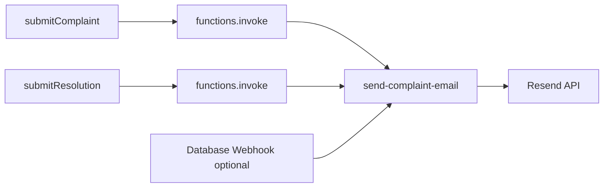

# Complaint Email Notifications

Transactional emails are sent via a Supabase Edge Function (`send-complaint-email`) and [Resend](https://resend.com) when:

1. A user **submits a complaint** (after all answers are saved)
2. An admin or staff member **updates complaint status** (Pending → In Progress → Resolved)

Recipients are resolved from `public.student."Email"` or `public.staff."Email"` based on who filed the complaint.

> **Prerequisites:** Complete [PHASE1_SETUP.md](./PHASE1_SETUP.md) (auth, migrations, frontend env).

---

## 1. Resend setup

1. Create a [Resend](https://resend.com) account.
2. **Domains** → Add `siit.tu.ac.th` (or your sending subdomain) and complete DNS verification.
3. **API Keys** → Create a key with send permissions.

For testing before domain verification, Resend allows sending to your own verified email from `onboarding@resend.dev`.

---

## 2. Supabase secrets

Set secrets on your linked Supabase project:

```bash
npx supabase link --project-ref <your-project-ref>

npx supabase secrets set \
  RESEND_API_KEY=re_xxxxxxxx \
  NOTIFICATION_FROM_EMAIL="SIIT Complaints <complaints@siit.tu.ac.th>" \
  APP_URL=https://your-app.vercel.app
```

| Secret | Purpose |
|--------|---------|
| `RESEND_API_KEY` | Resend API authentication |
| `NOTIFICATION_FROM_EMAIL` | Verified sender address (must match Resend domain) |
| `APP_URL` | Base URL for “View your complaint” links (no trailing slash required) |

Supabase automatically injects `SUPABASE_URL`, `SUPABASE_ANON_KEY`, and `SUPABASE_SERVICE_ROLE_KEY` into edge functions.

---

## 3. Deploy the edge function

```bash
npx supabase functions deploy send-complaint-email
```

Verify in Supabase Dashboard → Edge Functions → `send-complaint-email`.

---

## 4. Local development

Create `supabase/.env.local` (already gitignored):

```env
RESEND_API_KEY=re_xxxxxxxx
NOTIFICATION_FROM_EMAIL="SIIT Complaints <complaints@siit.tu.ac.th>"
APP_URL=http://localhost:3000
```

Serve the function alongside local Supabase:

```bash
npx supabase start
npx supabase functions serve send-complaint-email --env-file supabase/.env.local
```

The React app invokes the function through the Supabase client; no extra frontend env vars are required.

---

## 5. How it works



| Event | Trigger | Email subject (example) |
|-------|---------|-------------------------|
| `submission_created` | [`complaintsService.js`](../frontend/src/lib/complaintsService.js) after answer loop | Complaint #123 received — Academic Issues |
| `status_changed` | Same service after status update | Complaint #123 updated — now Resolved |

Notifications are **fire-and-forget**: if email fails, the complaint is still saved and a warning is logged in the browser console.

---

## 6. Optional: Database Webhook (production hardening)

The frontend already invokes the function after status updates. Add a webhook if status might be changed outside the React app (SQL, Dashboard, future admin tools).

1. Supabase Dashboard → **Database** → **Webhooks** → **Create a new hook**
2. **Table:** `public.submission`
3. **Events:** `UPDATE`
4. **Type:** Supabase Edge Functions (or HTTP Request)
5. **URL:** `https://<project-ref>.supabase.co/functions/v1/send-complaint-email`
6. **HTTP Headers:** `Authorization: Bearer <SERVICE_ROLE_KEY>`
7. **Filter (recommended):** only when `record.Status` is distinct from `old_record.Status`

The edge function accepts both the frontend JSON body and the Supabase webhook payload (`type`, `record`, `old_record`).

---

## 7. Verification checklist

| Step | Expected result |
|------|-----------------|
| Student submits a complaint | Email to `student.Email`; Resend dashboard shows delivery |
| Admin changes status on `/admin/respond/:id` | Email with old → new status |
| Submit without Resend secrets configured | Complaint saves; console warns; function returns 500 |
| Unauthorized invoke (wrong user) | 403; no email sent |

---

## 8. Troubleshooting

| Symptom | Likely cause | Fix |
|---------|--------------|-----|
| `Email notification secrets are not configured` | Missing Resend secrets | Run `supabase secrets set` and redeploy |
| Resend 403 / domain error | Unverified sender domain | Complete DNS verification in Resend |
| No email but `{ ok: true, skipped: true }` | Submitter has no email in DB | Check `student` / `staff` row |
| Function 401 | User not logged in | Ensure session is active before submit |
| Link in email 404 | Wrong `APP_URL` | Update secret to match deployed frontend URL |

---

## Key files

| Purpose | Path |
|---------|------|
| Edge function | [`supabase/functions/send-complaint-email/index.ts`](../supabase/functions/send-complaint-email/index.ts) |
| Frontend invoke | [`frontend/src/lib/complaintsService.js`](../frontend/src/lib/complaintsService.js) |
| Admin status source | [`frontend/src/components/AdminResponsePage.js`](../frontend/src/components/AdminResponsePage.js) |
