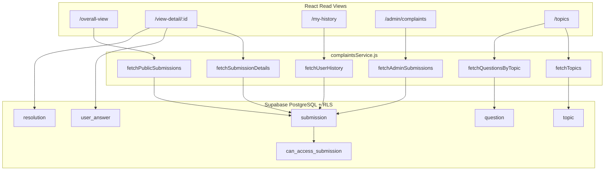

# Phase 2: Read Paths, Topic Visibility & Data Layer Hardening

Phase 2 stabilizes **read-only complaint flows** on Supabase: public overall view, submission detail, topics/questions, student history, and staff/admin list views. It verifies that **RLS—not the React UI—is the source of truth** for sensitive topic access (Topics 1 and 2).

> **Prerequisites:** Complete [PHASE1_SETUP.md](./PHASE1_SETUP.md) first (auth, migrations through `20250601000005_submission_rpc.sql`, env vars).

---

## Phase 2 Goal

| Exit criterion | Description |
|----------------|-------------|
| Public reads work | Anonymous users see only Topics **3–5** on `/overall-view` and `/view-detail/:id` |
| Student reads work | Students see their own submissions (including Topics 1–2) in `/my-history` and detail view |
| Staff reads are scoped | Staff see admin queue rows filtered by division for Topics 1–2 |
| No legacy PHP reads | No component calls `http://localhost/.../backend/*.php` for data |
| Clear denied states | Unauthorized detail access shows a friendly message, not a generic network error |

---

## Current Status (as of this doc)

During Phase 1 troubleshooting, several Phase 2/3 items were implemented early:

| Area | Status | Primary file(s) |
|------|--------|-----------------|
| Supabase read service | Done | [`frontend/src/lib/complaintsService.js`](../frontend/src/lib/complaintsService.js) |
| Overall public list | Done | [`OverallResponseView.js`](../frontend/src/components/OverallResponseView.js) |
| Submission detail | Done (needs UX polish) | [`SubmissionDetail.js`](../frontend/src/components/SubmissionDetail.js) |
| Student history | Done | [`UserHistory.js`](../frontend/src/components/UserHistory.js) |
| Topics / questions (file complaint) | Done | [`ComplaintStart.js`](../frontend/src/components/ComplaintStart.js) |
| Admin submission list | Done | [`AdminResponseSheet.js`](../frontend/src/components/AdminResponseSheet.js) |
| RLS read helpers | Done | [`20250601000002_rls_helpers_and_policies.sql`](../supabase/migrations/20250601000002_rls_helpers_and_policies.sql) |
| Student complaint submit (RPC) | Done (Phase 3 scope) | [`20250601000005_submission_rpc.sql`](../supabase/migrations/20250601000005_submission_rpc.sql) |

**Phase 2 remaining work** is verification, UX hardening, dead-code removal, and security audit—not re-wiring fetch calls.

---

## Architecture: Read Data Flow



All read queries go through `@supabase/supabase-js` with the anon/authenticated key. **Row visibility is enforced in Postgres**, not by filtering in React.

---

## Topic Visibility Rules (locked)

| Viewer | Topics 3–5 | Topic 1 (Academics) | Topic 2 (Abuse) |
|--------|------------|---------------------|-----------------|
| Anonymous | Read list + detail | **Hidden** | **Hidden** |
| Student | Read public list + **own** submissions | Submit + read **own only** | Submit + read **own only** |
| Staff (matched division) | Full admin read | Read/write if `Division = 'Academic Affairs'` | Read/write if `Division = 'Student Affairs'` |
| Staff (other division) | Full admin read | **Hidden** | **Hidden** |
| Admin | Full access | Full access | Full access |

Mapping table: `topic_staff_access` (seeded in migration `20250601000001`).

---

## Step 1 — Confirm migrations & seed data

From the repo root:

```bash
npx supabase db push
```

Verify in Supabase Dashboard → Table Editor:

- `topic` has 5 rows (IDs 1–5)
- `question` has rows for each topic
- `topic_staff_access` has `(1, Academic Affairs)` and `(2, Student Affairs)`

If tables are empty locally:

```bash
npx supabase db reset
```

---

## Step 2 — Remove remaining legacy read references

| Action | File |
|--------|------|
| Delete dead component (unused, still calls PHP) | [`frontend/src/components/TopicSelection.js`](../frontend/src/components/TopicSelection.js) |
| Confirm no `localhost` backend URLs remain | Run `rg "localhost.*backend" frontend/src` — should return **zero** matches |

---

## Step 3 — Harden read-path UI

Implement the following (Phase 2 implementation tasks):

### 3a. Submission detail: public vs authenticated header

[`SubmissionDetail.js`](../frontend/src/components/SubmissionDetail.js) always renders `AuthHeader`. For anonymous visitors on `/view-detail/:id`, use the same pattern as [`OverallResponseView.js`](../frontend/src/components/OverallResponseView.js):

- Authenticated → `AuthHeader`
- Anonymous → `PublicHeader`

### 3b. Access-denied messaging

When RLS blocks a row, Supabase returns empty data (not always a 403). Map these cases explicitly:

| Scenario | Expected UI message |
|----------|---------------------|
| Submission ID does not exist | "Submission not found." |
| Submission exists but RLS hides it (Topic 1/2) | "You do not have permission to view this submission." |
| Generic Supabase error | Show `getErrorMessage(error)` from [`authErrors.js`](../frontend/src/lib/authErrors.js) |

Update `fetchSubmissionDetails` / `SubmissionDetail` to distinguish **null data** (hidden or missing) from **errors**.

### 3c. Overall view empty state copy

Confirm `/overall-view` shows only Topics 3–5 for anonymous users. If the list is empty, distinguish:

- "No public complaints yet." (valid)
- vs. a fetch/RLS failure (show error)

---

## Step 4 — Run Supabase security advisors

After migrations are applied:

```bash
npx supabase db advisors --linked
```

Or use Supabase Dashboard → Database → Security Advisor.

Fix any reported issues on:

- `submission`, `user_answer`, `resolution` SELECT policies
- `topic_staff_access` exposure
- Storage bucket policies (`complaint-evidence`, `resolution-attachments`)

Document fixes as new migrations (`supabase migration new <name>`), never edit applied migration files in place.

---

## Step 5 — Verification checklist

Run these tests **after** `npm start` with a fresh browser session.

### Anonymous (logged out)

- [ ] `/overall-view` loads without error
- [ ] List contains **only** Topics 3, 4, 5 (never 1 or 2)
- [ ] Opening a public submission detail works
- [ ] Direct URL to a Topic **1** or **2** submission shows permission/not-found message (not a crash)

### Student (`@g.siit.tu.ac.th`)

- [ ] `/my-history` lists own submissions including Topics 1–2
- [ ] `/overall-view` still hides others' Topics 1–2
- [ ] Can open own sensitive submission detail
- [ ] Cannot open another student's Topic 1/2 detail (paste their submission ID in URL)

### Staff (`@siit.tu.ac.th`, division registered in `staff` table)

- [ ] `/admin/complaints` lists submissions for public topics
- [ ] Staff with `Academic Affairs` sees Topic **1** rows
- [ ] Staff with `Student Affairs` sees Topic **2** rows
- [ ] Staff with other divisions (e.g. `Building`) do **not** see Topics 1–2

### Admin

- [ ] `/admin/complaints` lists all submissions across topics
- [ ] Detail view loads for any submission ID

---

## Step 6 — Optional improvements (Phase 2 stretch)

These are not required for exit criteria but reduce maintenance cost:

| Improvement | Benefit |
|-------------|---------|
| SQL view `submission_public_list` | Single query for overall view; hides join complexity |
| SQL view `submission_detail` | Bundles submission + topic name for detail page |
| `status_log` table + trigger on `submission.Status` update | Parity with legacy MySQL audit log ([README](../README.md)) |
| PascalCase → snake_case views | Easier Supabase JS ergonomics (see roadmap open item) |

---

## Key files reference

| Purpose | Path |
|---------|------|
| Read/write API (frontend) | [`frontend/src/lib/complaintsService.js`](../frontend/src/lib/complaintsService.js) |
| Auth session | [`frontend/src/contexts/AuthProvider.js`](../frontend/src/contexts/AuthProvider.js) |
| RLS helpers | [`supabase/migrations/20250601000002_rls_helpers_and_policies.sql`](../supabase/migrations/20250601000002_rls_helpers_and_policies.sql) |
| Write RPCs | [`supabase/migrations/20250601000005_submission_rpc.sql`](../supabase/migrations/20250601000005_submission_rpc.sql) |
| Seed data | [`supabase/seed.sql`](../supabase/seed.sql) |

---

## What comes after Phase 2

The original roadmap split write/admin work across later phases. Based on current progress:

| Phase | Remaining scope |
|-------|-----------------|
| **Phase 3** | Harden student writes (direct RLS insert vs RPC), profile edge cases, complaint form validation |
| **Phase 4** | Admin resolution RPC, storage policy tightening, delete safeguards, attachment UX |
| **Phase 5** | Remove [`backend/`](../backend/) PHP, update [`README.md`](../README.md), production Vercel env, legacy data import |

---

## Troubleshooting

| Symptom | Likely cause | Fix |
|---------|--------------|-----|
| Overall view empty for anon | No seed data or RLS too strict | `supabase db reset`; verify `can_access_submission` for Topic 3+ |
| Student sees others' Topic 1 complaints | RLS not applied | `npx supabase db push` |
| Detail shows "not found" for own submission | `student.UUID` mismatch | Re-login; verify `student` row UUID = Auth user ID |
| Staff sees no Topic 1 rows | Wrong `Division` in `staff` | Update division to `Academic Affairs` or `Student Affairs` |
| `function … does not exist` | Missing RPC migration | Push migration `20250601000005` |

For auth setup issues, see [PHASE1_SETUP.md](./PHASE1_SETUP.md).
